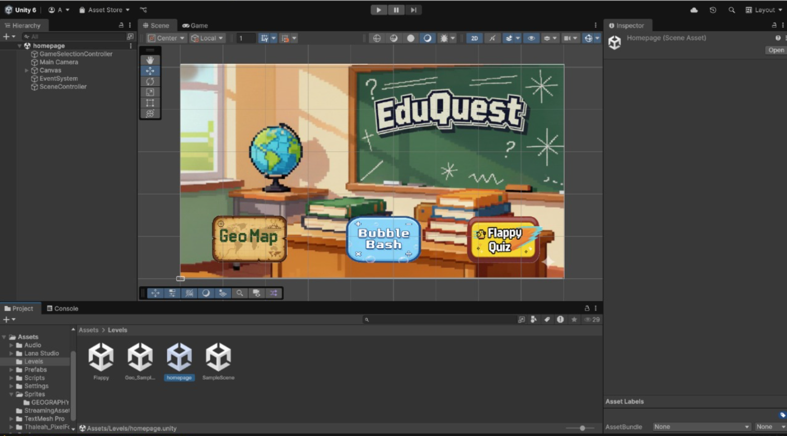
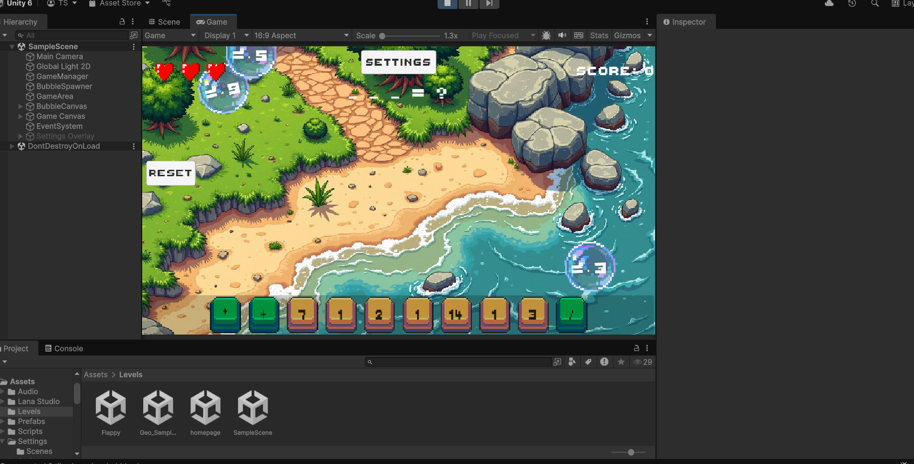
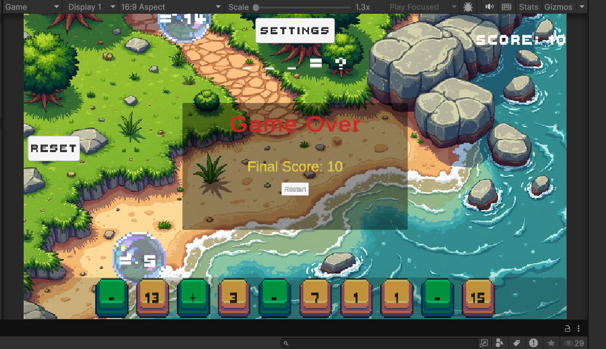
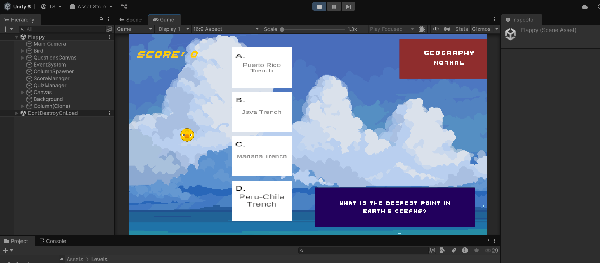
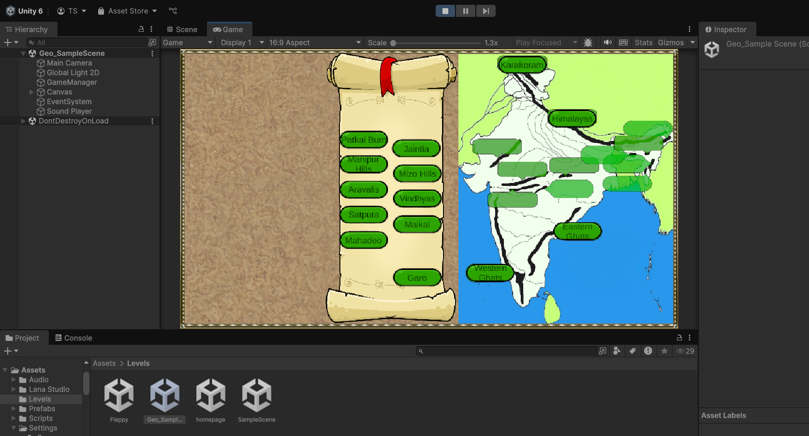
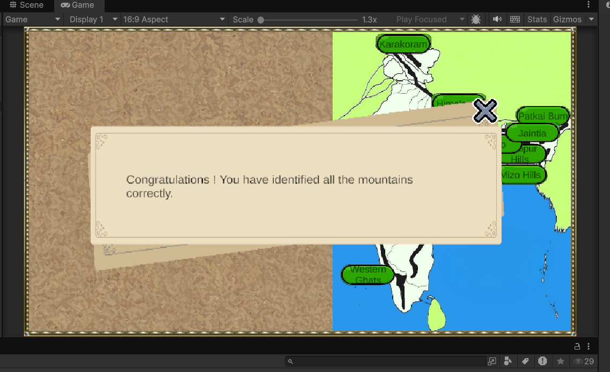

# 🎮 EduQuest – Educational Game Platform
**EduQuest** is an interactive **educational game platform** developed as a **Third-Year Minor Project** 
under *Project Based Learning: Minor Project–I* for the academic year **2025–2026**. The platform is 
designed to make learning more **engaging, interactive, and enjoyable** for school students by integrating 
curriculum-based concepts with game mechanics.

---

## 📘 Project Overview
Traditional learning methods often rely heavily on textbooks and rote memorization, which can reduce student engagement and conceptual understanding. EduQuest aims to bridge this gap by introducing **game-based learning** that combines academics with interactive gameplay. The platform consists of **three educational mini-games**, each targeting a different learning objective while encouraging problem-solving, critical thinking, and self-paced learning.

---

## 🧑‍🤝‍🧑 Team Members
- **Sagar Shetty**  
- **Pragati Tiwari**  
- **Tanukriti Sangal**  
- **Aditya Srivastava**

**Project Guide:** Dr. Datta Deshmukh  
**Institute:** K. J. Somaiya Institute of Technology, Mumbai

---

## 🏠 Home Page

The home page acts as a central hub that allows users to select and navigate between the three educational games.

  

---

## 🎮 Games Included

### 🧮 Math Bubble Bash

 A mathematics-based game designed to strengthen arithmetic and logical reasoning skills through interactive challenges. 

**Gameplay:**
- Math questions are formed using operators present on screen  
- Multiple bubbles appear with possible answers  
- Players pop the correct bubbles to form valid equations  
- Score and lives are tracked in real time  

  

  

---

### 🐦 Flappy Bird Quiz

 A quiz-based game inspired by Flappy Bird mechanics, focused on general knowledge, recall, and decision-making. 

**Gameplay:**
- Players control a bird to navigate obstacles  
- General knowledge questions guide the path selection  
- Correct answers allow progress  
- Incorrect answers or collisions end the game  

  

  

---

### 🌍 GeoMap (Geography Mapper)

An interactive geography game that enhances spatial awareness and memory through map-based learning.

**Gameplay:**
- A map is displayed with unlabeled regions  
- Students drag and drop mountain range names  
- Correct placement reinforces geographical understanding  
- Completion message confirms success  

  

  

---

## 🛠️ Technology Stack

- **Game Engine:** Unity (2D Game Development)  
- **Programming Language:** C#  
- **UI Framework:** Unity UI Toolkit / Unity 2D Canvas  
- **Deployment Target:** Unity WebGL (planned)  
- **Version Control:** Git and GitHub  

---

## 🚧 Project Status

🟡 **Currently Paused**

Development on EduQuest is **temporarily paused** due to semester transition and academic requirements. The existing  
implementation represents a **completed and evaluated minor project**, and serves as a foundation for future enhancements.

---

## 🌱 Learning Outcomes

- Unity game development fundamentals  
- Game logic implementation using C#  
- Designing educational gameplay mechanics  
- UI/UX design for school students  
- Team collaboration and project planning  

---

## 🚀 Future Scope

- Add adaptive difficulty and AI-based learning  
- Expand to additional subjects (Science, History)  
- Introduce progress tracking and teacher dashboards  
- Integrate AR/VR for immersive education  
- Improve UI/UX and accessibility  

---

## ⚠️ Disclaimer

This project was developed **strictly for academic and educational purposes** as part of a minor project submission.  
All content is intended for learning and demonstration only.

---
